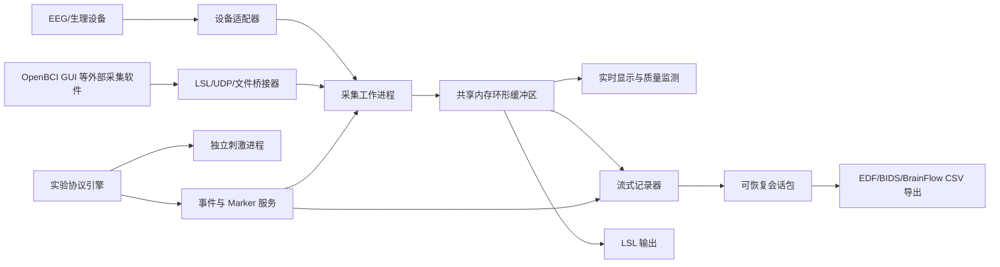

# 跨平台脑电采集工作站方案

版本：0.1（产品与技术方案草案）
目标平台：Windows、Linux、macOS
首个硬件目标：OpenBCI Cyton
项目定位：科研与技术验证工具，不作为医疗诊断设备

## 1. 产品目标

开发一个本地优先的桌面应用，把以下能力放进同一个工作站：

1. 脑电设备发现、连接、参数配置和信号质量检查；
2. 原始信号实时显示、频谱、通道状态、丢包和饱和告警；
3. 实验程序运行，包括当前 SSVEP 程序以及后续 P300、运动想象等协议；
4. 事件和硬件 marker 同步；
5. 原始数据、事件、设备配置、实验配置和日志统一保存；
6. 会话回放、数据导出和基础质量报告；
7. 与 OpenBCI GUI、Lab Streaming Layer、MATLAB、OpenViBE 及其他设备软件互通；
8. 在 Windows、Linux、macOS 上提供各自的安装包。

工作站首先解决“可靠采集和可追溯记录”，算法训练、在线分类和云端协作放在稳定采集之后。

## 2. 推荐技术路线

可选方案对比如下：

| 方案 | 优点 | 主要代价 | 结论 |
| --- | --- | --- | --- |
| PySide6 + BrainFlow | 最大程度复用现有 Python；信号处理生态完整；三平台桌面与打包路径清楚 | 需要认真处理 Python 原生依赖和安装包体积 | **首版推荐** |
| Tauri + Rust UI + Python sidecar | 安装包外壳较轻，前端体验好，后续可逐步把核心迁入 Rust | 首版要同时维护 Rust、Web、Python 和 IPC | 成熟后可评估换 UI 壳 |
| Electron + Python sidecar | Web 开发人员容易上手，组件生态丰富 | 内存占用和双运行时打包成本高 | 仅在团队以 Web 为主时选择 |
| Fork OpenBCI GUI | OpenBCI 功能起点高，可直接改中文和复用官方工具 | Processing/Java 代码定制成本高，较难形成厂商无关架构 | 作为内置 OpenBCI 模块和源码基线，不作为整个产品的唯一底座 |

### 2.1 首选方案

采用以下组合：

| 层 | 推荐技术 | 作用 |
| --- | --- | --- |
| 桌面 UI | PySide6 + Qt Widgets | 跨平台窗口、设备页、监视器、协议编辑器和会话管理 |
| 采集核心 | Python + BrainFlow | 统一连接 OpenBCI 和 BrainFlow 已支持的其他设备 |
| 实时绘图 | pyqtgraph | 波形、FFT、阻抗和质量指标 |
| 实验刺激 | 独立刺激进程，首版复用并改造 Pygame/OpenGL | 全屏刺激、逐帧时序、按键中止和显示器选择 |
| 外部互通 | LSL 为主，UDP/OSC 为兼容补充 | 与 OpenBCI GUI、MATLAB、OpenViBE 等交换信号和事件 |
| 本地进程通信 | 控制消息队列 + 共享内存环形缓冲区 | 隔离 UI、采集和刺激，避免绘图卡顿影响采集 |
| 元数据 | SQLite | 项目、受试者代号、会话索引和配置版本 |
| 原始会话 | 分块 HDF5 + JSON/TSV 日志 | 流式写入、崩溃恢复和多数据流保存 |
| 科研导出 | EDF+/BDF+/BrainVision、BIDS 目录、BrainFlow CSV | 供 MNE、EEGLAB、MATLAB 和现有流程使用 |
| 打包 | pyside6-deploy/Nuitka，按操作系统原生构建 | Windows、Linux、macOS 安装包 |

选择 PySide6 的主要原因是现有程序和 BrainFlow 接入均为 Python，能够直接复用，同时 Qt 官方提供 Windows、Linux 和 macOS 的桌面能力及部署工具。Qt 官方文档也明确说明 `pyside6-deploy` 面向三大桌面平台，但每个平台仍应在对应系统上单独构建和测试。[Qt for Python 部署文档](https://doc.qt.io/qtforpython-6/deployment/index.html)

BrainFlow 提供板卡无关 API，已经覆盖 Cyton、Cyton Daisy、Ganglion、Galea 以及多家其他设备；但不同设备和传输方式的平台支持并不完全一致，因此应用必须维护自己的“已验证硬件矩阵”，不能只显示 BrainFlow 的完整设备列表。[BrainFlow 支持设备](https://brainflow.readthedocs.io/en/stable/SupportedBoards.html)

### 2.2 暂不首选 Electron/Tauri 的原因

- Electron 或 Tauri 仍需额外运行 Python/BrainFlow sidecar，首版会同时承担 Web 前端、IPC、Python 打包和原生驱动四套复杂度；
- 当前团队资产是 Python 采集代码，PySide6 能更快形成可安装 MVP；
- 采集核心会通过稳定接口与 UI 解耦，未来如果已有成熟 Web 前端团队，可以替换桌面壳而不重写驱动、记录和协议层。

## 3. 总体架构



应用采用“模块化单体 + 隔离工作进程”，首版不做微服务：

- UI 进程只负责交互和低频状态，不直接读取串口；
- 采集进程独占设备，维护原始数据环形缓冲区并持续写盘；
- 刺激进程独占全屏显示，避免 UI 绘图或文件写入造成刺激掉帧；
- 插件或第三方桥接器出现异常时，不应拖垮主采集进程；
- 高频数据走共享内存，状态和控制命令走有版本的消息协议。

## 4. 核心模块

### 4.1 工作区与会话管理

数据层级采用：

```tex
Workspace
└── Projec
    └── Participant（只保存代号）
        └── Session
            └── Run
                ├── Streams
                ├── Events
                ├── Configuration
                └── Quality repor
```

会话必须按状态机运行：

```tex
IDLE → PREFLIGHT → ARMED → RECORDING → STOPPING → FINALIZED
                       ↘                 ↘
                         FAILED / ABORTED
```

只有 `PREFLIGHT` 全部通过后才能进入 `ARMED`。断电、设备断开或程序崩溃后，会话可以恢复为 `FAILED`，并保留已经写入的数据，而不是留下无法解释的半成品。

### 4.2 设备适配层

所有设备统一实现 `DeviceAdapter` 接口：

```python
class DeviceAdapter:
    def discover(self) -> list[DeviceInfo]: ...
    def capabilities(self) -> DeviceCapabilities: ...
    def validate(self, config: DeviceConfig) -> list[Issue]: ...
    def connect(self, config: DeviceConfig) -> None: ...
    def configure_channels(self, channels: list[ChannelConfig]) -> None: ...
    def start(self) -> None: ...
    def read(self, max_samples: int) -> SampleBlock: ...
    def insert_marker(self, event: MarkerEvent) -> None: ...
    def stop(self) -> None: ...
    def disconnect(self) -> None: ...
```

首批适配器：

1. `BrainFlowAdapter`：Cyton、Cyton Daisy、Ganglion，之后按验证结果开放其他 BrainFlow 板卡；
2. `LSLInletAdapter`：接收由 OpenBCI GUI 或其他厂商软件发布的信号；
3. `PlaybackAdapter`：回放历史 BrainFlow 文件，仅用于离线分析；
4. 当前生产版本不启用 Synthetic/Preview 采集适配器，自动测试只验证配置、拒绝边界和元数据逻辑。

BrainFlow 的 Playback、Streaming 和 Synthetic Board 可作为未来离线开发方向，但当前生产采集只允许已验证的 OpenBCI Cyton，不通过这些板卡生成实验数据。[BrainFlow Playback/Streaming Board](https://brainflow.readthedocs.io/en/stable/SupportedBoards.html)

设备列表只显示当前操作系统上已验证的组合，并明确列出：连接方式、通道数、采样率、辅助信号、是否支持阻抗、是否支持硬件 marker、所需权限和驱动版本。

### 4.3 实时数据管线

每个数据块统一携带：

- `stream_id`、设备型号和设备序列号；
- 通道名、类型、单位、采样率和增益；
- 原始设备时间戳；
- 主机单调时钟；
- 数据块序号、丢包数和队列丢弃数；
- 配置版本和校准信息。

数据处理分成两条路径：

- 原始路径：不滤波，优先写盘，任何显示或算法都不得阻塞它；
- 显示路径：降采样、陷波、带通、FFT 和质量估计，只用于监视，不能覆盖原始数据。

实时质量检查至少包括：有效采样比例、平线、饱和、突跳、工频能量、RMS、时间戳间隙、实际采样率和缓冲区积压。

### 4.4 实验协议与刺激引擎

实验协议不再硬编码在一个 Python 文件中，而是使用带版本的协议定义：

```yaml
protocol_version: 1
name: ssvep_four_targe
display:
  refresh_rate_hz: 60
  monitor_id: primary
timeline:
  - rest: 10s
  - repeat:
      randomized: true
      trials:
        - target: top_lef
          frequency_hz: 10
          stimulus: 5s
events:
  stimulus_onset: 110
  stimulus_offset: 210
```

正式刺激引擎需要补齐：

- 显示器选择、实际刷新率检测和全屏独占；
- 基于帧号而不是普通 `sleep` 的刺激相位；
- 每帧计划时间、提交时间、掉帧数和显示配置记录；
- Esc/Q 全阶段安全中止；
- 屏幕角落 photodiode patch；
- 可选 TTL/数字输出，用仪器实测屏幕亮起与 marker 之间的偏差；
- 同一协议和随机种子可复现；
- 刺激程序与采集程序使用同一会话 ID 和事件字典。

事件至少记录四个时间：请求时间、刺激提交时间、采集端 marker 请求时间、数据中 marker 实际出现时间。软件时间戳不能替代 photodiode/TTL 的物理延迟校准。

### 4.5 记录、恢复与导出

建议将一次采集保存为一个不可变会话包：

```tex
session_20260910_143000/
├── session.json
├── journal.jsonl
├── streams.h5
├── events.tsv
├── channels.tsv
├── protocol.yaml
├── device_config.json
├── quality.json
├── logs/
└── manifest.sha256
```

记录策略：

- 每 0.5～1 秒分块写盘并刷新 journal；
- 先写临时状态，正常结束后原子切换为 `FINALIZED`；
- 会话包内保存应用版本、依赖版本、操作系统、设备固件、配置哈希和时钟信息；
- 原始数据永不被显示滤波覆盖；
- 导出是派生操作，导出失败不能破坏原始会话；
- 每次导出保存参数和哈希。

科研导出建议优先支持 BIDS 目录及 EDF+/BrainVision。BIDS 为 EEG 定义了会话、事件、通道、电极和坐标系统元数据，适合后续长期管理；规范接受 EDF、BrainVision、EEGLAB、BDF 等 EEG 数据格式，并推荐 EDF 或 BrainVision。[BIDS 规范](https://bids-specification.readthedocs.io/en/stable/) [EEG-BIDS 数据格式说明](https://bids-specification.readthedocs.io/en/v1.4.0/04-modality-specific-files/03-electroencephalography.html)

### 4.6 回放模式

回放不是简单打开文件，而是复用实时数据管线：

- 可变速、暂停、拖动和循环；
- 重放原始信号、事件和质量指标；
- 让算法和插件把回放视为实时输入；
- 支持 BrainFlow CSV、OpenBCI RAW、工作站会话包，并逐步增加 EDF/BDF/XDF；
- 自动测试使用固定回放数据验证波形、marker 和导出结果。

## 5. OpenBCI 与其他软件的集成方式

### 5.1 两种互斥采集模式

#### 模式 A：工作站直接采集

```tex
OpenBCI 设备 → BrainFlowAdapter → 工作站 → 本地记录 + LSL 输出
```

这是推荐模式。设备串口或蓝牙连接由工作站独占，工作站完成记录、刺激和 marker，再把数据通过 LSL 发布给 MATLAB、OpenViBE 或自定义程序。

#### 模式 B：第三方软件桥接

```tex
OpenBCI 设备 → OpenBCI GUI → LSL → 工作站
```

OpenBCI GUI 已支持通过 LSL、UDP、OSC 和 Serial 输出数据，也能通过 UDP 接收 marker；工作站可以作为 LSL 接收方或 UDP marker 发送方。[OpenBCI GUI Networking/Marker](https://docs.openbci.com/Software/OpenBCISoftware/GUIWidgets/)

两个模式不能同时打开同一个串口。UI 中要明确显示“设备所有者”，检测到占用时给出可操作提示，不能静默重试。

### 5.2 集成中心

“集成”分三级，不建议一开始把每个第三方应用打包进安装包：

| 级别 | 方式 | 首版范围 |
| --- | --- | --- |
| A：协议兼容 | LSL、UDP、OSC、文件导入导出 | 必做 |
| B：受管启动 | 检测外部软件、启动参数、连接状态和配置向导 | OpenBCI GUI 可做 |
| C：原生插件 | 厂商 SDK、设备专有功能、双向命令 | 按设备逐个增加 |

LSL 适合作为默认实时互通总线，因为它支持 Windows、Linux、macOS，包含流发现、时间同步和多语言接口；LabRecorder 通常将多路流记录为 XDF。[LSL 介绍](https://labstreaminglayer.readthedocs.io/info/intro.html)

首版集成目标：

| 对象 | 输入 | 输出 | 备注 |
| --- | --- | --- | --- |
| OpenBCI Cyton | BrainFlow 串口 | 原始数据、marker、LSL | 第一优先级 |
| OpenBCI GUI | LSL、BrainFlow CSV、OpenBCI RAW | LSL、UDP marker | 桥接模式，不抢串口 |
| MATLAB | LSL、导出文件 | LSL marker/结果流 | 提供连接示例 |
| OpenViBE | LSL | LSL marker/分类结果 | OpenBCI 官方也推荐 LSL 路径 |
| Python/MNE | 会话包、BIDS、EDF | LSL 或结果文件 | 提供 SDK 示例 |
| 其他厂商设备 | BrainFlow 或独立插件 | 统一数据块 | 先做能力与许可评审 |

OpenBCI 官方说明 GUI 可实时显示、回放、记录 CSV/BDF+ 并通过 LSL 等协议连接第三方软件。本项目除兼容这些边界外，还会拉取 OpenBCI GUI 官方 Git 源码，在团队 fork 中完成中文化和工作站集成重构。[OpenBCI GUI 文档](https://docs.openbci.com/Software/OpenBCISoftware/GUIDocs/)

### 5.3 OpenBCI GUI 源码级重构

主项目通过 `scripts/sync_openbci_gui.ps1` 或 `scripts/sync_openbci_gui.sh` 拉取 OpenBCI GUI，版本由 `integrations/openbci_gui/upstream.lock.json` 锁定。源码保留为独立 Git 工作区，以便持续同步官方上游；正式重构提交保存在团队 fork，不直接修改不可追溯的源码副本。

OpenBCI GUI 采用 Processing/Java，本工作站采用 Python/PySide6，两者不能直接链接成一个进程。产品层采用“一个安装包、一个启动入口、两个隔离进程”：

```tex
脑电工作站启动器（PySide6）
├── 原生采集工作区（Python/BrainFlow）
└── OpenBCI 工作区（重构后的 Processing/Java GUI）
    └── Workstation Bridge（会话、配置、状态、LSL/marker）
```

用户从工作站中点击“OpenBCI 工作区”即可进入，不需要另外下载或配置 OpenBCI GUI。两个进程共享工作站生成的会话 ID、受试者代号、记录目录和语言设置，但仍遵守单一设备所有权：OpenBCI 工作区占用板卡时，Python 采集进程只接收桥接数据，不能再次打开串口。

不建议用跨平台窗口句柄把 Processing 窗口强行嵌入 PySide6 窗口；这会在 macOS、Wayland、高 DPI 和多显示器环境产生焦点与渲染问题。首版保持两个顶级窗口，由同一个启动器和任务栏入口管理；后续再将确有价值的 OpenBCI 页面逐步重构进原生工作站界面。

重构分为四层：

1. 国际化基础层：抽取硬编码字符串、英文回退、语言切换和设置迁移；
2. 中文显示层：简体中文词库、Noto Sans SC 字体、中文布局与高 DPI；
3. 工作站集成层：统一启动器、会话 ID、存储位置、日志和状态回传；
4. 数据互通层：BrainFlow、LSL、UDP marker 和历史文件兼容。

中文版首先覆盖完成一次 Cyton 采集所需的全部页面，然后扩展到 Networking、Playback、Marker 和其他 widgets。详细规则见 `integrations/openbci_gui/I18N_ZH_CN.md`。

源码重构按三个交付层推进：

1. **中文版 Fork**：建立国际化层、中文字体、核心页面翻译，能独立构建；
2. **受管 OpenBCI 工作区**：由主工作站启动，读取统一语言/存储/会话配置并回传状态；
3. **能力融合**：将稳定的设备诊断、网络、回放等能力通过桥接接口提供给主工作站，逐步减少重复页面。

## 6. 插件体系

插件类型：

- `device`：新设备或厂商 SDK；
- `processor`：滤波、特征、分类器；
- `protocol`：SSVEP、P300、运动想象或自定义实验；
- `exporter`：EDF、BIDS、MAT、云端数据仓库；
- `integration`：外部应用或网络协议。

每个插件包含 manifest：

```json
{
  "id": "org.example.device",
  "version": "1.0.0",
  "api_version": "1",
  "type": "device",
  "platforms": ["windows", "linux", "macos"],
  "permissions": ["serial", "bluetooth"],
  "entrypoint": "plugin.worker:main"
}
```

安全和稳定性原则：

- 插件默认在独立进程运行，不允许直接修改 UI 或记录器内存；
- 插件 API 和会话格式分别版本化；
- 插件声明串口、蓝牙、网络、文件等权限；
- 崩溃、超时和数据积压都能被主程序隔离和报告；
- 正式发布阶段增加签名、可信源、兼容性测试和禁用列表；
- 厂商 SDK 的再分发权、商标使用和驱动许可逐个审核。

## 7. 桌面界面建议

UI 作为独立开发工作流，由 GPT-6 负责界面原型、设计系统、PySide6 页面和组件代码；采集核心、设备驱动、记录器和实验时序不放进 UI 工程。无硬件环境只能验收页面、配置和错误边界，不启动或伪造 EEG 采集。

```tex
apps/workstation-ui/          # GPT-6 独立维护的 PySide6 UI
├── app/
├── pages/
├── components/
├── design_system/
├── locales/
│   ├── zh-CN.json
│   └── en-US.json
├── mock_data/
└── tests/

src/eeg_workstation/          # 采集与领域核心，不依赖具体 UI
└── ui_gateway/               # UI 唯一允许调用的稳定接口
```

两边通过版本化 `UiGateway` 交互。UI 只能发送连接、预检、开始、停止、插入 marker、加载会话等命令，并订阅设备状态、降采样显示数据、质量指标和任务进度；UI 不直接打开串口、不直接操作 BrainFlow，也不直接写原始数据文件。

UI 独立开发规则：

- 中文优先设计，`zh-CN` 为默认语言，`en-US` 完整回退；所有文字使用词条键，禁止硬编码；
- 先使用 mock adapter 完成全部页面和状态，再接 `UiGateway`；
- GPT-6 每次交付需同时提供界面截图/可交互原型、组件代码和状态测试；
- 人工评审确认信息层级、脑电术语、危险操作和无障碍后才能合入；
- 采集中的主按钮、设备所有权、丢包、掉帧、磁盘不足和异常中止属于安全关键状态，不能只做视觉测试；
- UI 工程拥有单独测试任务和变更记录，但最终随工作站安装包一起发布；
- OpenBCI GUI 中文 Fork 是受管的独立进程，其页面不与 PySide6 组件混写。

首轮 UI 评审采用可交互视觉原型；确认导航、密度、颜色和主要操作后，再由 GPT-6 转换为 PySide6/Qt Widgets 实现，避免在交互方向未确认前投入大量桌面代码。

主导航保留七个区域：

1. **首页**：最近项目、设备状态、快速开始；
2. **设备**：发现、连接、通道映射、阻抗与信号检查；
3. **监视器**：时域、频域、头皮图、辅助信号和质量告警；
4. **实验**：协议模板、参数、试运行、正式运行；
5. **会话**：记录列表、回放、备注、质量报告和导出；
6. **集成**：LSL 流、OpenBCI GUI、MATLAB/OpenViBE 连接向导；
7. **设置与诊断**：存储位置、隐私、日志、依赖和硬件诊断。

正式采集界面只保留必要信息：连接状态、剩余时间、当前试次、各通道质量、掉帧/丢包、磁盘空间和停止按钮，避免在采集中修改关键配置。

### 7.1 采集应用入口与任务流程

实验协议在工作站中表现为“采集应用”，采用应用图标网格，而不是让用户先操作脚本或配置文件。首批入口包括 SSVEP 屏幕闪烁、静息态、P300 和自定义协议；未安装或尚未完成的协议显示状态，但不能进入不可用流程。

SSVEP 的标准交互为：

```tex
采集应用 → SSVEP 图标 → 任务说明与参数 → 预检 → 5 秒倒计时
        → 全屏执行 → 自动结束 → 任务摘要 → 系统工作站 / 数据集
```

SSVEP 详情页必须在开始前显示：

- 实验目的和屏幕闪烁提示；
- 当前设备、串口、采样率、通道配置与电极模板；
- 刺激频率、刷新率、单次刺激、试次休息、重复次数和总试次数；
- 根据参数实时计算的预计采集时间；
- 受试者代号、会话名称和保存位置；
- 显示器、marker、磁盘空间、信号质量和通道位置预检结果；
- 视觉不适时按 Esc/Q 中止的安全说明。

点击“开始采集”后锁定关键参数并倒计时 5 秒。执行页显示总进度、已用/剩余时间、当前试次、目标位置、刺激频率、采集状态、marker 状态、丢包和掉帧；正式刺激进入指定显示器全屏，工作站控制页保持简化监控状态。

任务完成或中止后显示：状态、实际时长、完成试次数、样本数、事件数、异常摘要、会话 ID 和保存路径。结果页顶部提供“系统工作站 / 数据集”面包屑和“查看数据集”主操作，进入会话页面并定位刚完成的数据集，可继续查看波形、质量报告、回放和导出。

交互原型不得真的播放 10～20 Hz 高频闪烁；只显示静态目标示意或低风险占位状态。真实刺激只能在已完成安全提示与显示器预检的正式采集程序中运行。

## 8. 跨平台打包与系统适配

每个平台原生构建，不依赖单个平台交叉生成全部安装包：

| 平台 | 首版产物 | 关键适配 |
| --- | --- | --- |
| Windows 10/11 x64 | MSI 或签名 EXE | COM 端口、驱动检测、DPI、多显示器、代码签名 |
| macOS Intel/Apple Silicon | `.app` + DMG | `/dev/cu.*`、蓝牙权限、USB 权限、签名与 notarization |
| Ubuntu 22.04/24.04 x64 | AppImage + `.deb` | `dialout`/udev 权限、glibc、Wayland/X11、桌面文件 |

BrainFlow 文档特别指出，Cyton 在 macOS 应使用 `/dev/cu.*`，Unix 类系统还需要正确的串口权限；这些差异应由设备向导处理，而不是让用户阅读终端报错。[BrainFlow Cyton 平台说明](https://brainflow.readthedocs.io/en/stable/SupportedBoards.html#cyton)

CI/CD 至少包含：

- 三个平台的依赖锁定、构建和启动冒烟测试；
- macOS Intel 与 Apple Silicon 分别验证；
- 安装、升级、卸载和用户数据保留测试；
- 生成 SBOM、第三方许可清单和构建哈希；
- Windows 签名、macOS notarization；
- 发布通道分为 internal、beta、stable。

发布前需专项审核 PySide6、BrainFlow、LSL、厂商 SDK 与打包方式的许可义务。BrainFlow 和 OpenBCI GUI 当前仓库采用 MIT 许可，LSL 核心库也采用 MIT；BrainFlow 许可证另有其所含 SimpleBLE 的使用限制，不能只看顶层许可证名称。[BrainFlow LICENSE](https://github.com/brainflow-dev/brainflow/blob/master/LICENSE) [OpenBCI GUI 仓库](https://github.com/OpenBCI/OpenBCI_GUI) [liblsl 仓库](https://github.com/sccn/liblsl)

## 9. 数据安全与隐私

- 默认完全本地运行，不要求登录，不自动上传脑电数据；
- 受试者使用随机代号，姓名、联系方式与原始数据分开保存；
- 崩溃报告和使用统计默认关闭或显式征得同意；
- 支持工作区加密或保存到系统加密磁盘；
- 导出前提示是否包含受试者字段；
- 保存操作日志，但不在普通日志中写入脑电样本和个人信息；
- 删除操作进入回收站或提供二次确认与保留策略；
- 如果未来用于临床诊断或治疗，需单独启动医疗器械法规、质量体系和风险管理工作，不能沿用“科研工具”声明直接发布。

## 10. 测试与验收

### 10.1 自动测试

- 协议解析、事件码唯一性和配置迁移；
- 环形缓冲区溢出、背压、分块写入和崩溃恢复；
- Cyton 真实硬件连续采集与中止恢复；
- OpenBCI 历史文件导入和只读回归；
- LSL 输入/输出回环；
- 会话导出后样本数、单位、通道顺序、事件和哈希一致；
- 三平台启动、打开工作区、回放和导出冒烟测试。

### 10.2 硬件在环测试

每一种正式支持的硬件和平台组合都要测试：

- 连接、断开、重连和串口被占用；
- 30 分钟、2 小时和通宵稳定性；
- USB 拔出、蓝牙断连、电脑睡眠和磁盘写满；
- 丢包、有效采样率、时间戳单调性和 marker 完整性；
- 高 DPI、双显示器、不同刷新率和全屏切换；
- photodiode/TTL 测得的刺激延迟与抖动。

### 10.3 MVP 验收指标

- Cyton 在三平台能完成发现/配置/采集/停止/回放；
- 原始数据在 UI 卡顿时仍不丢失；
- 异常中止后可找回已写入数据和错误原因；
- 每次会话都有配置副本、事件表、质量报告和完整性校验；
- SSVEP 全程记录掉帧，支持 photodiode patch；
- 能发布 LSL EEG 与 marker 流，并能接收 OpenBCI GUI 的 LSL 流；
- 安装后无需用户手工安装 Python；
- 同一回放文件在三平台得到一致的样本数和事件数。

## 11. 分阶段开发路线

### 阶段 0：产品与风险冻结（1～2 周）

- 明确科研/教学/临床定位；
- 明确首批设备、平台版本和安装形式；
- 定义会话格式、事件模型、插件 API v1；
- 制作 UI 原型和硬件测试矩阵；
- 确认第三方许可和设备 SDK 获取条件。

### 阶段 1：可安装采集 MVP（4～6 周）

- PySide6 桌面壳和工作区；
- Cyton 直接采集、通道配置和实时波形；
- 流式写盘、异常恢复、会话索引；
- 真实 Cyton 采集与 OpenBCI 历史导入；不提供 Synthetic/Preview 生产模式；
- Windows、Linux、macOS CI 安装包。

### 阶段 2：实验与时序（3～5 周）

- 协议引擎与独立刺激进程；
- 迁移当前 SSVEP；
- marker 时间模型、掉帧记录、photodiode patch；
- 质量报告和回放；
- BIDS/EDF 或 BrainVision 首个科研导出路径。

### 阶段 3：软件互通（3～4 周）

- LSL 输入、EEG 输出和 marker 输出；
- OpenBCI GUI 桥接向导；
- MATLAB、OpenViBE、Python 示例；
- BrainFlow/OpenBCI 文件导入。

### 阶段 4：设备和插件扩展（持续）

- Cyton Daisy、Ganglion；
- 插件进程、manifest 和兼容性检查；
- 按需求接入其他厂商 SDK；
- 签名插件、自动更新和稳定发布通道。

单人开发可先完成阶段 0～2 的垂直切片，再扩展集成；如果由 2～3 人并行负责桌面 UI、采集/数据和测试/发布，MVP 风险会明显降低。时间估算需在设备清单和 UI 原型确定后重新评估。

## 12. 当前代码的迁移映射

现有项目不需要推倒重来：

| 当前文件 | 迁移位置 | 处理方式 |
| --- | --- | --- |
| `check_cyton_live.py` | `diagnostics/cyton_check.py` | 保留 CLI，同时接入设备向导 |
| `run_ssvep_session.py` | `protocols/ssvep/runner.py` | 拆分协议、刺激、事件和采集编排 |
| `configs/ssvep_config_v1.json` | `protocols/ssvep/default.yaml` | 增加 schema 和版本迁移 |
| `configs/channel_config_v1_template.json` | `profiles/devices/cyton_8ch.json` | 增加电极模板和 UI 编辑 |
| `eeg_tools/config.py` | `domain/config/` | 扩展为带版本的数据模型 |
| `eeg_tools/session_files.py` | `recording/` | 改为流式写入、journal 和导出 |

建议下一步仓库结构：

```tex
apps/workstation-ui/          # GPT-6 独立开发的 PySide6/Qt Widgets UI
src/eeg_workstation/
├── domain/                   # 会话、设备、事件、协议模型
├── acquisition/              # 工作进程、缓冲区、设备适配器
├── stimulus/                 # 独立刺激进程
├── recording/                # 会话包、恢复、哈希
├── processing/               # 显示滤波和质量检测
├── integrations/             # LSL、UDP、OpenBCI GUI
├── playback/
├── export/
└── plugins/
protocols/
profiles/
resources/
tests/
├── unit/
├── integration/
└── hardware/
packaging/
├── windows/
├── linux/
└── macos/
docs/
integrations/openbci_gui/     # OpenBCI GUI 版本锁、中文化规范和集成说明
scripts/                      # 三平台源码同步与构建入口
```

## 13. 开工前必须确认的五个决定

1. 产品只用于科研/教学，还是未来有临床用途？
2. MVP 除 Cyton 外，必须支持 Cyton Daisy、Ganglion 或哪些厂商设备？
3. 是否需要两台以上设备同步采集，以及是否有眼动、动作捕捉、心电等多模态流？
4. 第三方软件的“集成”是互通和一键启动，还是必须把其功能重新做进本应用？
5. 首个正式实验只做 SSVEP，还是同时支持可视化协议编辑器？

在这些决定明确前，最稳妥的开发起点是：**Cyton 直接采集 + 实时监视 + 可恢复记录 + SSVEP + 回放 + LSL 输入/输出 + 三平台安装包**。这条垂直链路完成后，再增加设备和算法，不会反复推翻核心数据结构。
